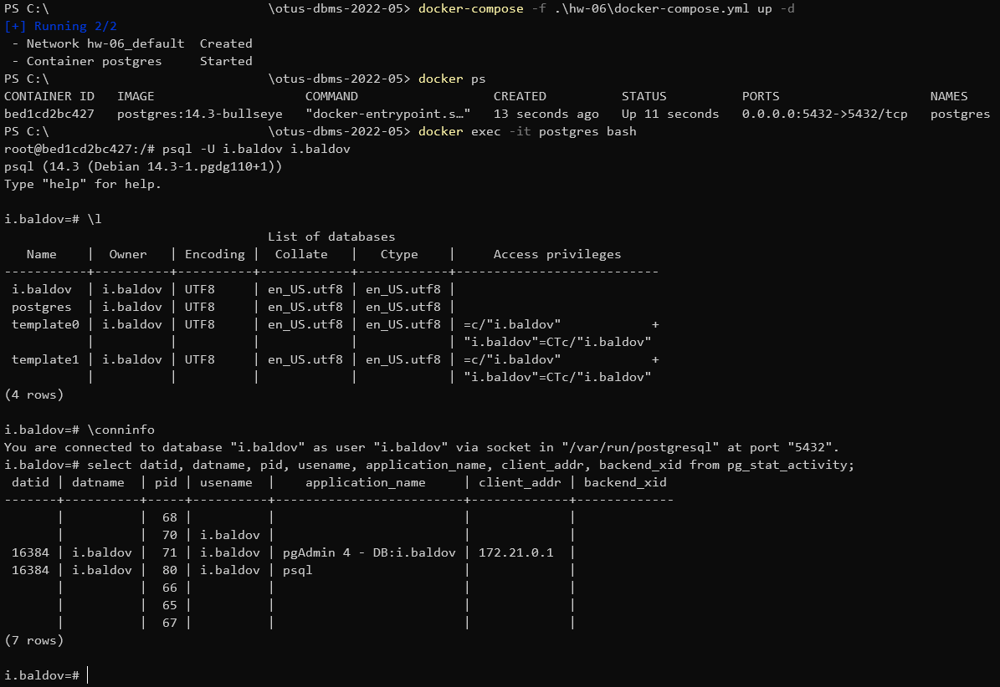
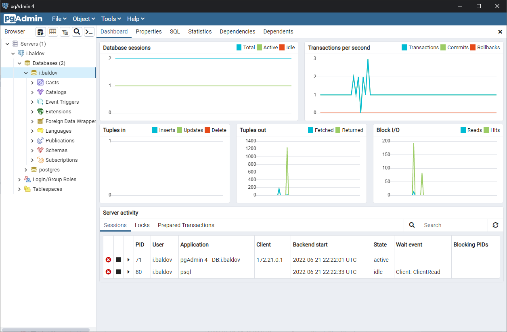

# Домашнее задание №6
1. Развернуть контейнер с PostgreSQL или установить СУБД на виртуальную машину.
    * Переименовать файлы, удалив из названия файла `_example`
        ```
        hw-06/env_vars/.env_db_pgsql_example
        hw-06/env_vars/.POSTGRES_PASSWORD_example
        hw-06/env_vars/.POSTGRES_USER_example
        ```
    * Заполнить файлы из пункта выше нужными данными

1. Запустить сервер.
    ```
    docker-compose -f ./hw-06/docker-compose.yml up -d # Linux
    docker-compose -f .\hw-06\docker-compose.yml up -d # Windows
    ```

1. Создать клиента с подключением к базе данных postgres через командную строку.
    * Найти нужный контейнер
        ```
        docker ps
        ```
    * Подключиться к контейнеру
        ```
        docker exec -it postgres bash
        ```

    * Промотр БД
        ```
        \l
        \conninfo
        select datid, datname, pid, usename, application_name, client_addr,    backend_xid from pg_stat_activity;
        ```
    Результат на рисунке ниже

    
1. Подключиться к серверу используя pgAdmin или другое аналогичное приложение.

    Результат подключения через ПО pgAdmin на рисунке ниже

    

1. Остановить сервер.
    ```
    docker-compose -f ./hw-06/docker-compose.yml down # Linux
    docker-compose -f .\hw-06\docker-compose.yml down # Windows
    ```
